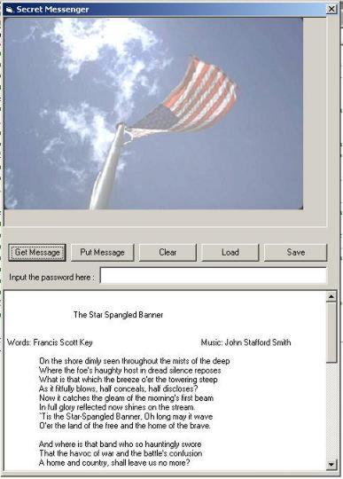



## Another Message in a Picture

### Description

Did you ever hear that "A picture is worth a thousand words"? Well, my program take it literally. It can add to a picture a thousand words and more depending on the picture size. Just think of this: in a bitmap of 800x600 pixels can be hidden up to 160,000(160 thousand!) characters. And the text will be encrypted in the strongest way you have ever seen. I also included a quiz, in case you don't believe me about the encryption strength. Note: You must have the color depth set to 32 bits.
 
### More Info
 

             |
---                |---
**Submitted On**   |2001-12-03 22:31:16
**By**             |[Bog Crist](https://github.com/Planet-Source-Code/PSCIndex/blob/master/ByAuthor/bog-crist.md)
**Level**          |Intermediate
**User Rating**    |5.0 (70 globes from 14 users)
**Compatibility**  |VB 6\.0
**Category**       |[Encryption](https://github.com/Planet-Source-Code/PSCIndex/blob/master/ByCategory/encryption__1-48.md)
**World**          |[Visual Basic](https://github.com/Planet-Source-Code/PSCIndex/blob/master/ByWorld/visual-basic.md)
**Archive File**   |[Another\_Me392201232001\.zip](https://github.com/Planet-Source-Code/bog-crist-another-message-in-a-picture__1-29435/archive/master.zip)

